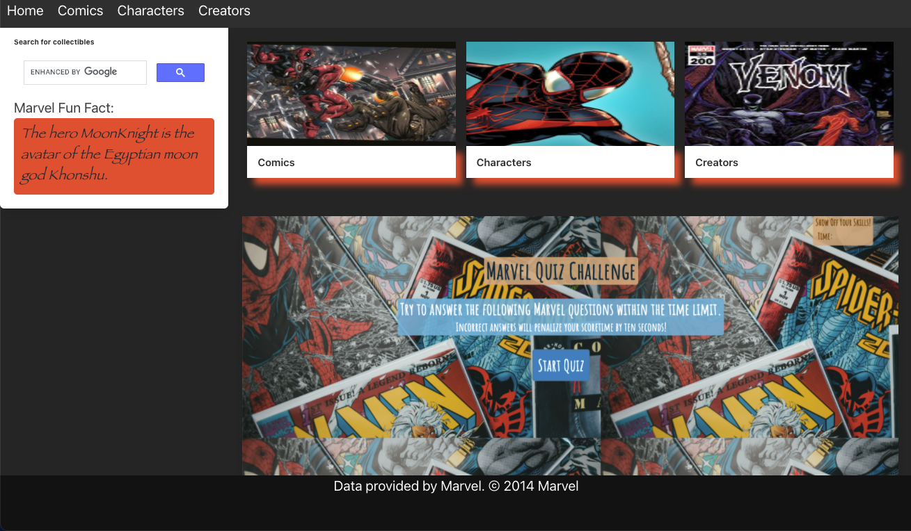
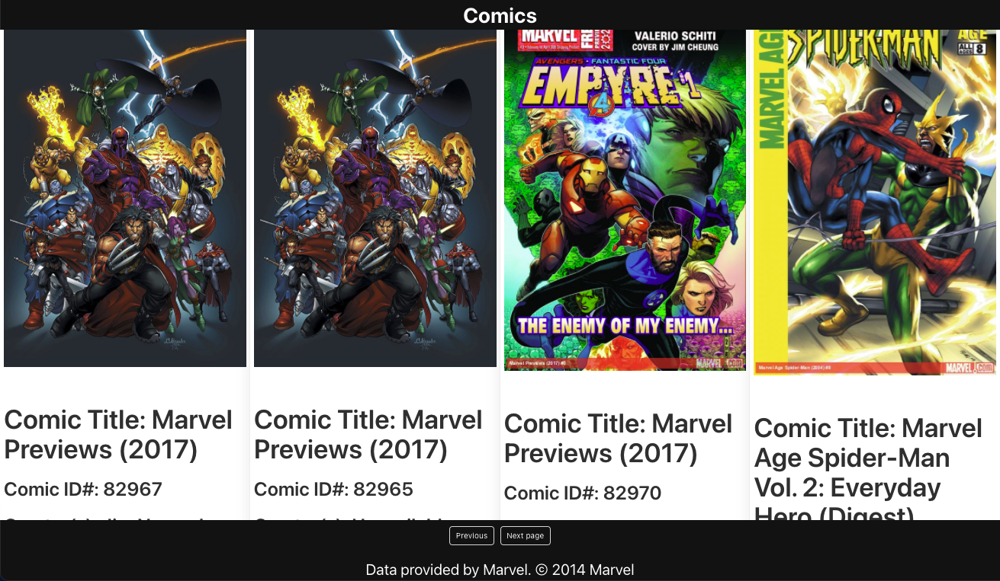

# Marvelisms

## Description

- What was our motivation? We needed to create a Marvel database so that fans could find interesting facts, collectibles, and have fun.
- Why did we build this project? We built this project so that fans could quickly navigate to interesting data within the Marvel universe, while testing and expanding their knowledge through fun quizzes and facts or searching for interesting Marvel paraphernalia on the internet.
- What problem does it solve? This project presents a nice location for fans to discover more about the Marvel Universe, test their own knowledge, and search for more information.
- What did we learn? This project primarily builds up skills for the developers in managining Server Side APIs and CSS framerworks. Other skills involved: JavaScript, jQuery, Bulma, and GitHub branches.

## Table of Contents

- [Installation](#installation)
- [Usage](#usage)
- [Credits](#credits)
- [License](#license)
- [Links](#links)

## Installation

Although this is simply a webpage and no installation is necessary, there were certain criteria that had to be met in order to complete this project:

    User Story

    AS A user I WANT to view a Marvel database designed for fans of the Marvel Universe
    SO THAT I can learn more about the Marvel Universe, have fun, and buy collectibles

    Acceptance Criteria

    GIVEN I need a database to house interesting Marvel facts
    WHEN I load the initial page
    THEN I am presented with images that link to different searchable topics within the Marvel world
    WHEN I load the initial page
    THEN I am presented with a Fun Fact from the Marvel Universe
    WHEN I load the initial page
    THEN I am presented with a link to a Marvel Quiz for fans to test their knowledge
    WHEN I load the initial page
    THEN I am presented with the Google Search API allowing me to search the internet for Marvel collectibles
    WHEN I click one of the image links
    THEN I am taken to a new page which provides information and links to the specified topics

## Usage

Please see below for examples of this webpage, which demonstrate its functionality:

### Main Page

### Comics Page

### Quiz Main Page

## Credits

### A special thanks to Alan and Geoffrey Fimister for providing their extensive Marvel knowledge as a resource!

- https://javascript.info/
- https://jqueryui.com/
- https://unsplash.com/photos/8SeJUmfahu0
- https://bulma.io/
- https://developer.marvel.com/
- https://coding-boot-camp.github.io/full-stack/github/professional-readme-guide

## License

MIT License

Copyright (c) [2021] [Jack McNary, John Gallagher, Hannah Franz, and Colleen Fimister]

Permission is hereby granted, free of charge, to any person obtaining a copy
of this software and associated documentation files (the "Software"), to deal
in the Software without restriction, including without limitation the rights
to use, copy, modify, merge, publish, distribute, sublicense, and/or sell
copies of the Software, and to permit persons to whom the Software is
furnished to do so, subject to the following conditions:

The above copyright notice and this permission notice shall be included in all
copies or substantial portions of the Software.

THE SOFTWARE IS PROVIDED "AS IS", WITHOUT WARRANTY OF ANY KIND, EXPRESS OR
IMPLIED, INCLUDING BUT NOT LIMITED TO THE WARRANTIES OF MERCHANTABILITY,
FITNESS FOR A PARTICULAR PURPOSE AND NONINFRINGEMENT. IN NO EVENT SHALL THE
AUTHORS OR COPYRIGHT HOLDERS BE LIABLE FOR ANY CLAIM, DAMAGES OR OTHER
LIABILITY, WHETHER IN AN ACTION OF CONTRACT, TORT OR OTHERWISE, ARISING FROM,
OUT OF OR IN CONNECTION WITH THE SOFTWARE OR THE USE OR OTHER DEALINGS IN THE
SOFTWARE.

## Links

[Live Link](https://carlincb.github.io/Marvelisms/)

[GitHub Link](https://github.com/carlincb/Marvelisms)
